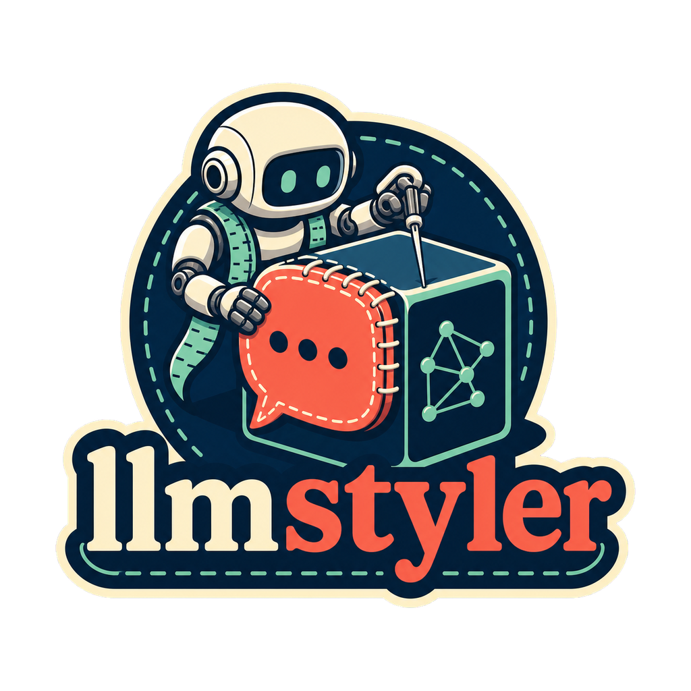
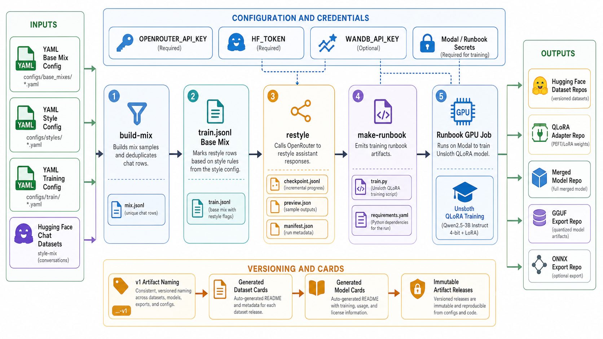

<div align="center">
  

  **🧵 Config-driven style datasets for fine-tuned chat models 🧵**
</div>

llmstyler is a Python CLI for building speaking-style supervised fine-tuning
datasets and publishing the resulting model artifacts. It starts with YAML
configs, samples chat rows from Hugging Face datasets, rewrites selected
assistant responses through OpenRouter, and generates Runbook training files for
Unsloth QLoRA jobs.

The main workflow is: build a reusable base mix, restyle the marked rows, create
a training runbook, then publish versioned Hugging Face datasets and model
exports.

## Install

```bash
git clone https://github.com/tsilva/llmstyler.git
cd llmstyler
python3 -m venv .venv
source .venv/bin/activate
uv pip install -e ".[dev]"
```

Run the CLI from the repo root:

```bash
llmstyler --help
```

## Commands

```bash
llmstyler build-mix configs/base_mixes/smoltalk_style_mix.yaml
llmstyler build-mix configs/base_mixes/smoltalk_style_mix.yaml --push-to-hub

llmstyler restyle configs/styles/trump_public_speaking.yaml --estimate-only
llmstyler restyle configs/styles/trump_public_speaking.yaml
llmstyler restyle configs/styles/trump_public_speaking.yaml --push-to-hub

llmstyler make-runbook configs/train/qwen25_3b_trump.yaml
runbook runs/qwen25_3b_trump/train.py \
  --gpu A10 \
  --secret wandb-secret \
  --secret huggingface-secret \
  --timeout 14400 \
  --output runs/qwen25_3b_trump/train.ipynb
```

## Notes

- Python 3.11 or newer is required.
- Example configs live under `configs/base_mixes/`, `configs/styles/`, and
  `configs/train/`.
- `OPENROUTER_API_KEY` is required for `llmstyler restyle` unless using
  `--estimate-only`.
- `HF_TOKEN`, or an authenticated Hugging Face CLI session, is required when
  pushing datasets or model artifacts.
- Remote training expects Modal/Runbook secrets named `huggingface-secret` and
  optionally `wandb-secret`.
- Generated local artifacts are ignored by git: `datasets/`, `runs/`, and
  `outputs/`.
- Published artifact names should be immutable and versioned, such as
  `owner/style-mix-restyled-name-v1`, `owner/model-style-qlora-v1`,
  `owner/model-style-gguf-v1`, and `owner/model-style-onnx-v1`.
- Restyle outputs include a checkpoint, preview file, manifest, and dataset card.
  Training outputs include model cards for adapter, merged, GGUF, and optional
  ONNX exports.

## Architecture



## License

No license file is present in this repository.
